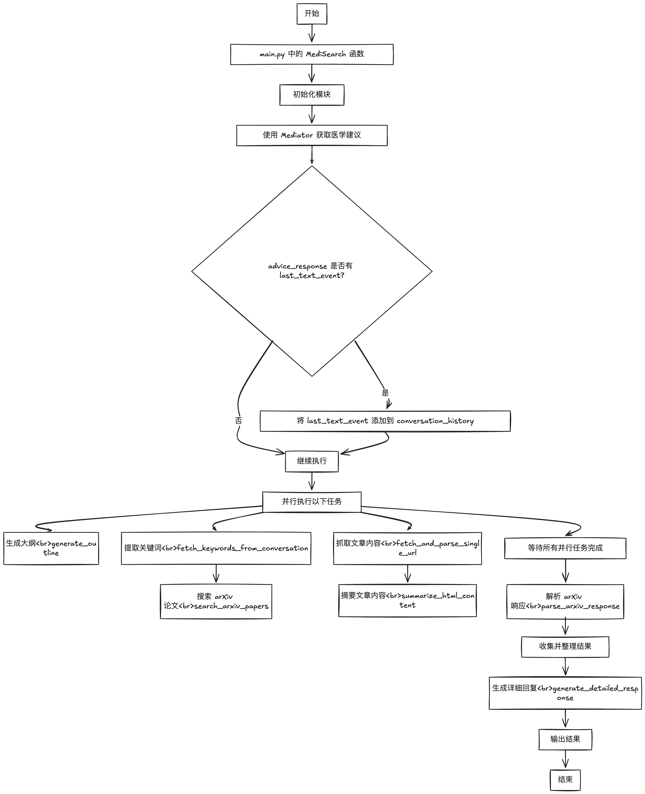

<!--
 * @Date: 2024-06-05 12:31:39
 * @LastEditors: yangyehan 1958944515@qq.com
 * @LastEditTime: 2024-10-14 17:20:43
 * @FilePath: /memfree-main/Users/mac/Documents/jingfangzhigu/jingfangzhigu_mutiple_agents-main/jingfangzhigu_1.0/MediSearch/readme.md
 * @Description: 
-->
# 项目名称

MediSearch 医学咨询与参考文献检索系统

# 项目运行逻辑


## 项目简介

MediSearch 是一个集医学咨询、内容总结、大纲生成和参考文献检索于一体的综合系统。通过整合多个模块，包括与大型语言模型（LLM）的交互、网页抓取、arXiv 论文搜索和性能跟踪，MediSearch 能够为用户提供专业、详细的医学回答，并附带相关的参考文献支持。

## 功能特点

- **医学咨询**：与 MediSearchClient 交互，获取专业的医学建议。
- **内容总结**：对网页内容进行抓取和总结，生成简短易懂的摘要。
- **大纲生成**：根据对话历史，生成结构化的大纲，帮助用户理解关键点。
- **arXiv 论文检索**：自动提取关键词，搜索 arXiv 论文，提供最新的学术参考。
- **性能跟踪**：跟踪各个模块的性能，便于优化和改进。

## 目录结构

```
/project_root
├── modules/
│   ├── web_scraper.py         # 网页抓取和解析模块
│   ├── summarizer.py          # 内容总结和大纲生成模块
│   ├── performance_tracker.py # 性能跟踪模块
│   ├── llm_handler.py         # 与 LLM 交互的模块
│   ├── arxiv_search.py        # arXiv 论文搜索和解析模块
│   ├── mediator.py            # 与 MediSearchClient 交互的模块
├── main.py                    # 主程序入口
├── config.py                  # 配置文件，存储 API 密钥等信息
├── requirements.txt           # 项目依赖的第三方库
├── README.md                  # 使用说明文件（您正在阅读的文件）
```

## 安装指南

### 1. 克隆仓库

首先，克隆项目到本地：

```bash
git clone https://github.com/yourusername/medisearch.git
```

### 2. 进入项目目录

```bash
cd medisearch
```

### 3. 创建虚拟环境（可选）

建议使用虚拟环境来管理项目的依赖：

```bash
# 使用 virtualenv
python -m venv venv
source venv/bin/activate  # Linux/macOS
venv\Scripts\activate     # Windows

# 或者使用 conda
conda create -n medisearch python=3.8
conda activate medisearch
```

### 4. 安装依赖

使用以下命令安装项目所需的依赖库：

```bash
pip install -r requirements.txt
```

`requirements.txt` 文件内容：

```
requests
beautifulsoup4
html2text
```

### 5. 配置 API 密钥

在项目根目录下的 `config.py` 文件中，配置您的 API 密钥：

```python
# config.py
API_KEY = "你的API密钥"  # 请将此处替换为您的实际 API 密钥
```

> **注意**：请确保您的 API 密钥保密，不要泄露给他人。

## 使用说明

### 运行程序

在终端中，运行以下命令启动程序：

```bash
python main.py
```

### 示例调用

程序内置了一个示例的 `conversation_history`，如下所示：

```python
conversation_history = [
    "什么是高血压的治疗方法？",
    "高血压的治疗方法包括药物治疗和非药物治疗。非药物治疗包括改变生活方式，如控制体重、健康饮食、增加运动、减少压力和限制酒精摄入。药物治疗方面，常用的药物包括利尿剂、钙通道阻滞剂、血管紧张素转换酶抑制剂、血管紧张素受体拮抗剂等。根据患者的具体情况，医生会根据血压水平和存在的心血管疾病风险来决定是否需要药物治疗，并选择合适的药物进行治疗。",
    "高血压对身体的影响有哪些？"
]
```

您可以根据需要修改 `conversation_history`，输入您关心的问题。

### 输出结果

程序运行后，将输出以下内容：

- **Response**：MediSearchClient 返回的初始回答。
- **Detailed Response**：经过整合和加工的详细回复，包含参考文献支持。
- **Outline**：根据对话历史生成的结构化大纲。
- **Reference**：参考文献列表，包括标题、URL 和摘要。
- **Performance Data**：各个模块的性能数据，显示函数调用次数和耗时。

### 示例输出

```plaintext
Response: 高血压对身体的影响包括心血管系统损害，如心脏病、心力衰竭和中风；肾脏损害，可能导致肾功能衰竭；眼部损害，导致视力问题；以及动脉硬化，增加其他健康风险。

Detailed Response:
（此处将显示详细的回复，包含参考文献）

Outline:
- 高血压的治疗方法
  - 非药物治疗
    - 控制体重
    - 健康饮食
    - 增加运动
    - 减少压力
    - 限制酒精摄入
  - 药物治疗
    - 利尿剂
    - 钙通道阻滞剂
    - 血管紧张素转换酶抑制剂
    - 血管紧张素受体拮抗剂
- 高血压对身体的影响
  - 心血管系统损害
  - 肾脏损害
  - 眼部损害
  - 动脉硬化

Reference:
ID    标题                                 URL                                         摘要
---------------------------------------------------------------------------------------------------
[1]   高血压的危害及预防措施                  http://example.com/hypertension            高血压是心血管疾病的主要风险因素...
---------------------------------------------------------------------------------------------------
[2]   控制血压的重要性                        http://example.com/bloodpressurecontrol    控制血压可以有效减少中风和心脏病的风险...
---------------------------------------------------------------------------------------------------

Performance Data:
函数名                                     调用次数    总时间(秒)           平均时间(秒)
-------------------------------------------------------------------------------------------
generate_response                         5          12.34              2.47
fetch_and_parse_single_url                3          6.78               2.26
...
```

## 模块说明

### 1. modules/web_scraper.py

用于抓取网页内容，并解析为纯文本。

### 2. modules/summarizer.py

负责将 HTML 内容转换为 Markdown 格式，并使用 LLM 生成摘要和大纲。

### 3. modules/performance_tracker.py

提供性能跟踪装饰器和性能数据打印函数，帮助监控各模块的性能。

### 4. modules/llm_handler.py

与大型语言模型（LLM）交互，发送请求并获取响应。

### 5. modules/arxiv_search.py

从对话历史中提取关键词，搜索 arXiv 论文，并解析搜索结果。

### 6. modules/mediator.py

与 MediSearchClient 交互，获取医学建议和相关文章。

## 注意事项

- **API 密钥安全**：请确保您的 API 密钥安全，不要将其上传到公共仓库或分享给他人。
- **依赖库版本**：请确保安装的依赖库版本与项目兼容，必要时可在 `requirements.txt` 中指定版本号。
- **模型文件**：确保 `models/custom_llm.py` 文件存在且可用，因为 `LLMHandler` 模块依赖于它。

## 常见问题

### 1. 程序无法运行，提示缺少模块或包

请确保已正确安装所有依赖库：

```bash
pip install -r requirements.txt
```

### 2. 收到 API 调用错误或权限错误

请检查您的 API 密钥是否正确配置，以及是否有调用权限。

### 3. 输出结果不完整或有误

可能是由于网络问题或 API 服务异常，请稍后重试。

## 联系方式

如有任何问题或建议，欢迎联系：

- **Email**: 1958944515@qq.com
- **GitHub**: [15392778677]()

## 许可证

此项目遵循 MIT 许可证。

---

感谢您使用 MediSearch！希望本项目能对您的学习和工作有所帮助。

```
优化前：
+-----------------------------------------+-------+----------------+--------------+
| Function                                | Calls | Total Time(s)  | Avg Time(s)  |
+-----------------------------------------+-------+----------------+--------------+
| fetch_medicine_advice_with_history      | 1     | 5.27           | 5.27         |
| fetch_and_parse_single_url              | 7     | 8.59           | 1.23         |
| summarize_html_content                  | 7     | 144.31         | 20.62        |
| generate_outline                        | 1     | 8.97           | 8.97         |
| MediSearch                              | 1     | 167.15         | 167.15       |
+-----------------------------------------+-------+----------------+--------------+
```


```
优化后：
+-----------------------------------------+-------+----------------+--------------+
| Function                                | Calls | Total Time(s)  | Avg Time(s)  |
+-----------------------------------------+-------+----------------+--------------+
| fetch_medicine_advice_with_history      | 1     | 7.04           | 7.04         |
| fetch_and_parse_single_url              | 5     | 8.57           | 1.71         |
| html_to_markdown                        | 5     | 0.01           | 0.00         |
| summarize_html_content                  | 5     | 39.48          | 7.90         |
| generate_outline                        | 1     | 7.43           | 7.43         |
| MediSearch                              | 1     | 23.38          | 23.38        |
+-----------------------------------------+-------+----------------+--------------+
```

# 智谷搜索response返回内容预览：
#### 研究背景

中草药与人工智能技术的结合代表了中医药研究的一个重要发展方向。随着人工智能技术的快速进步，尤其是在数据分析和模式识别方面，它为中草药的研究提供了新的视角和工具。中草药的复杂性和多样性使得传统的研究方法面临巨大挑战，而人工智能可以通过量化分析、机器学习等方法来解析中草药的有效成分及其在治疗特定疾病中的作用。

全面的领域分析显示，利用人工智能推动中草药研究的发展趋势正在形成，这不仅丰富了中草药的科学基础，也提高了其在全球医疗体系中的认可度。

#### 研究成果

根据最新的研究，中国在中草药领域的学术影响力显著，发表量占比达到54.35%。这表明中国在该领域的研究中发挥了关键作用，推动了相关理论和实践的进步。

- **发表量占比：** 54.35%
- **研究的关键作用：** 促进中草药的国际化，增强对其疗效的科学验证。

#### 重点研究疾病

在中草药应用中，有几个疾病的研究被认为尤为重要，具体包括：

1. **肝细胞癌**：中草药在肝细胞癌的辅助治疗中显示出良好效果，相关的配方和疗效机制研究正在增加。

2. **化学和药物性肝损伤**：研究发现某些中草药能够减轻药物引起的肝损伤，为药物安全提供了新的思路。

3. **Papillon-Lefèvre病**：该病罕见且复杂，中草药在综合治疗中的作用引起了关注，临床研究正在探索其潜在疗效。

4. **帕金森病**：研究表明，一些中草药可能有助于缓解帕金森病患者的症状，为神经退行性疾病的治疗提供了新方向。

5. **厌食症**：中草药在促进食欲和改善消化方面的潜力，使其在厌食症的治疗中逐渐成为研究重点。

#### 研究的意义

中草药与人工智能的结合为科学研究带来了重大意义：

- **重要信息提供**：通过计量分析和数据挖掘，提供了中草药在不同疾病治疗中作用的新见解，帮助研究人员更好地理解中草药的机制。

- **促进创新思维的发展**：借助人工智能的强大功能，启发新的研究方向和思路，推动中草药研究的多学科融合，进一步拓宽其应用领域。

这些研究不仅提升了中草药的科学地位，也为现代医学实践提供了宝贵的补充，展示了传统医学与现代科技结合的无限潜力。


<div style="text-align: center;">
    <a href="https://jingfang-images-1322234581.cos.ap-beijing.myqcloud.com/jfzg/1845746644262117376.png" target="_blank">
        
    </a>
</div>


### Related Papers to Organize Forms(English)
| Title | URL | Keywords | Summary |
|-------|-----|----------|---------|
| Sequential Condition Evolved Interaction Knowledge Graph for Traditional   Chinese Medicine Recommendation | [Link](http://arxiv.org/abs/2305.17866v2) | cs.AI, cs.IR |   Traditional Chinese Medicine (TCM) has a rich history of utilizing natural herbs to treat a diversity of illnesses. |
| TCM-FTP: Fine-Tuning Large Language Models for Herbal Prescription   Prediction | [Link](http://arxiv.org/abs/2407.10510v1) | cs.CL, cs.AI, cs.CE |   Traditional Chinese medicine (TCM) relies on specific combinations of herbs in prescriptions to treat symptoms and signs, a practice that spans thousands of years. |
| Herb-Drug Interactions: A Holistic Decision Support System in Healthcare | [Link](http://arxiv.org/abs/2306.15365v1) | cs.AI |   Complementary and alternative medicine are commonly used concomitantly with conventional medications leading to adverse drug reactions and even fatality in some cases. |
| Predicting Document Coverage for Relation Extraction | [Link](http://arxiv.org/abs/2111.13611v1) | cs.CL, cs.AI |   This paper presents a new task of predicting the coverage of a text document for relation extraction (RE): does the document contain many relational tuples for a given entity? Coverage predictions are useful in selecting the best documents for knowledge base construction with large input corpora. |
| Benchmarking Robot Manipulation with the Rubik's Cube | [Link](http://arxiv.org/abs/2202.07074v1) | cs.RO, cs.AI |   Benchmarks for robot manipulation are crucial to measuring progress in the field, yet there are few benchmarks that demonstrate critical manipulation skills, possess standardized metrics, and can be attempted by a wide array of robot platforms. |
| Free-hand gas identification based on transfer function ratios without   gas flow control | [Link](http://arxiv.org/abs/1812.05193v1) | physics.app-ph |   Gas identification is one of the most important functions of gas sensor systems. |


### 相关论文整理表格(Chinese)
| 标题 | URL | 关键词 | 摘要 |
|-------|-----|----------|---------|
| 演化交互知识图谱的顺序条件用于传统中医推荐 | [链接](http://arxiv.org/abs/2305.17866v2) | cs.AI, cs.IR |   传统中医（TCM）有着利用天然草药治疗多种疾病的丰富历史。 |
| TCM-FTP：用于草药处方预测的大型语言模型微调 | [链接](http://arxiv.org/abs/2407.10510v1) | cs.CL, cs.AI, cs.CE |   传统中医（TCM）依赖于特定的草药组合来治疗症状和体征，这一实践已有数千年的历史。 |
| 草药-药物相互作用：医疗保健中的整体决策支持系统 | [链接](http://arxiv.org/abs/2306.15365v1) | cs.AI |   传统与替代医学通常与常规药物同时使用，导致不良药物反应，甚至在某些情况下导致死亡。 |
| 关系提取的文档覆盖率预测 | [链接](http://arxiv.org/abs/2111.13611v1) | cs.CL, cs.AI |   本文提出了一项新的任务，即预测文本文档在关系提取（RE）方面的覆盖率：该文档是否包含许多与给定实体相关的元组？覆盖率预测对于从大量输入语料库中选择最佳文档以构建知识库非常有用。 |
| 使用魔方基准测试机器人操作 | [链接](http://arxiv.org/abs/2202.07074v1) | cs.RO, cs.AI |   机器人操作的基准测试对于衡量该领域的进展至关重要，但能展示关键操作技能、拥有标准化指标并可由多种机器人平台尝试的基准测试仍然较少。 |
| 基于传递函数比的自由手气体识别，无需气体流量控制 | [链接](http://arxiv.org/abs/1812.05193v1) | physics.app-ph |   气体识别是气体传感器系统最重要的功能之一。 |


